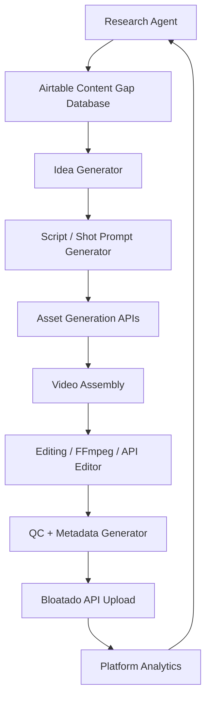

# Neon Parcel Shorts Automation Pipeline

## Purpose

This file is intended for Claude Code, Codex, Gemini CLI, or similar coding agents working inside the Neon Parcel workspace.

The goal is to build an automated pipeline for the **Neon Parcel YouTube channel**, which focuses on short-form, AI-generated animal comedy videos. The channel style is:

- Mostly YouTube Shorts.
- Realistic-looking AI-generated visuals.
- Animals, babies, grandmas, and impossible real-world situations.
- Slapstick humor.
- Slightly unhinged, surreal, absurd, and visually surprising.
- Safe, playful, and non-realistic even when the visuals look real.
- Minimal reliance on spoken language so clips can travel globally.

The pipeline should research content gaps, generate video ideas, create or assemble video assets through APIs, edit videos using API tools or FFmpeg, and upload finished content to all platforms through the **Bloatado API**.

This documentation should be cross-referenced with the user’s Obsidian Vault, especially:

- `toolbox.md` — lists available tools, APIs, local utilities, workspace commands, and environment details.
- Any Neon Parcel brand, prompt, video, platform, or upload documentation already present in the vault.

---

## Project Context

Neon Parcel is a short-form video brand centered on surreal, slapstick, animal-driven visual comedy.

The preferred creative format is:

1. A visually clear setup.
2. A surprising impossible animal or object interaction.
3. A slapstick escalation.
4. A fast punchline or visual twist.
5. A loopable ending when possible.

The videos should look realistic enough to feel like unusual found footage, but the events themselves should be impossible, surreal, or cartoonishly exaggerated.

Examples of the channel’s content territory:

- A grandma calmly preparing glowing ramen while a raccoon behaves like a tiny sous-chef.
- A baby and a red panda operating a toy-sized forklift.
- A sloth slowly stealing a teleportation remote from a grandma.
- A duck repeatedly failing to use a futuristic vending machine.
- A hidden animal appearing in the background as an Easter egg.
- A baby animal causing a chain reaction that looks cinematic but remains playful.

---

## Core Content Gap Hypotheses

These are the initial content gaps the research agent should validate and expand.

### 1. Surreal ASMR Food

#### Gap

ASMR and oddly satisfying content have large viewer interest, but much of the existing content is clinical, repetitive, or creator-centered.

#### Opportunity

Create AI-generated surreal food textures handled by a grandma, baby, or animal. The visuals should be satisfying, strange, and impossible.

Examples:

- Gold ramen stretching like melted cheese.
- Glowing yarn noodles.
- Jelly toast that bounces like a trampoline.
- Crystal dumplings that chime when stacked.
- A raccoon kneading moon dough.
- A capybara gently stirring a bowl of neon soup.

Useful concept tags:

- Surreal ASMR
- Weird ASMR
- Oddly satisfying
- Satisfying AI
- Unreal food
- Grandma cooking
- Animal kitchen chaos

---

### 2. Impossible Animal and Baby Interactions

#### Gap

Search interest exists around babies interacting with exotic or cute animals, but real-world footage is limited for safety and ethical reasons.

#### Opportunity

Use AI-generated scenes to create safe, impossible, non-real interactions between babies and animals.

The output must never imply that unsafe real-life animal interactions should be attempted. Videos should feel magical, absurd, and clearly impossible.

Examples:

- Baby and red panda running a tiny bakery.
- Baby and sloth using a miniature escalator.
- Baby otter delivering a package to a sleeping baby.
- Baby and baby elephant playing with a giant bubble machine.
- Baby and raccoon accidentally launching a confetti cannon.
- Baby penguin pushing a stroller full of marshmallows.

Useful concept tags:

- Baby and animal
- Impossible animal pairing
- Cute animal short
- Safe but impossible
- AI animal video
- Exotic baby animal
- Unexpected animal moment

---

### 3. Senior-Led Technology Fails

#### Gap

“Grandma vs technology” is a recurring interest area, but much of the existing content is real-life frustration or prank content.

#### Opportunity

Create high-concept, purely visual slapstick involving a grandma and impossible technology. Keep it playful, affectionate, and non-mocking.

Examples:

- Grandma using a teleporter that swaps her hat with a goose.
- Grandma ordering tea from a robot that serves soup to a raccoon instead.
- Grandma testing an AI vacuum that adopts a baby duck.
- Grandma using a hologram oven that produces floating pancakes.
- Grandma trying to scan a banana and accidentally opening a portal.
- Grandma riding a mobility scooter that behaves like a tiny spaceship.

Useful concept tags:

- Grandma technology fail
- Unexpected grandma
- AI robot comedy
- Visual slapstick
- Futuristic grandma
- Teleporter fail
- Robot animal chaos

---

## Visual Search Keyword Strategy

Use visual-first keywords and title structures.

Priority terms:

- Surreal
- Satisfying
- Hidden animal
- Unexpected
- Grandma
- Baby animal
- Impossible
- Weird ASMR
- Animal chaos
- AI animal
- Cute but cursed
- Slapstick
- Tiny disaster
- Oddly satisfying
- Realistic AI

Example title formulas:

- `Grandma Tried Making [Surreal Food] and [Animal] Had Other Plans`
- `Baby [Animal] Discovers [Impossible Object]`
- `This Raccoon Was Not Supposed to Use the [Technology]`
- `Hidden Animal in a Surreal ASMR Kitchen`
- `Grandma vs [Impossible Technology]`
- `Unexpected [Animal] Chaos in 12 Seconds`
- `A Baby Sloth Found the Teleporter`
- `The Duck Ordered One Thing and Got Something Else`

---

## Desired Pipeline Overview

The automation system should support this flow:



---

## Pipeline Stages

### Stage 1: Research Agent

The research agent should identify outlier content gaps across YouTube Shorts and related short-form platforms.

Likely research sources:

- YouTube Data API
- Perplexity API
- Platform search APIs if available
- Existing channel analytics if available
- Manual seed keywords from this file
- Prior Neon Parcel uploads and performance data

Research agent responsibilities:

1. Search for videos and Shorts around the target niches.
2. Identify high-interest topics with inconsistent or low-quality supply.
3. Collect examples of titles, thumbnails, descriptions, view counts, and engagement.
4. Identify recurring formats and missed opportunities.
5. Flag themes that fit Neon Parcel’s production style.
6. Store findings in Airtable.

The research agent should avoid copying existing videos directly. It should extract patterns and gaps, not clone specific ideas.

---

### Stage 2: Airtable Research Database

Research should likely be stored in Airtable.

Suggested tables:

#### `Content Gaps`

Fields:

- `Gap ID`
- `Niche`
- `Gap Description`
- `Audience Demand Signal`
- `Supply Weakness`
- `Neon Parcel Fit Score`
- `Risk Level`
- `Example Keywords`
- `Example Video URLs`
- `Observed Formats`
- `Recommended Concept Angles`
- `Date Researched`
- `Research Source`
- `Status`

#### `Seed Keywords`

Fields:

- `Keyword`
- `Niche`
- `Search Volume Proxy`
- `Competition Proxy`
- `Visual Potential`
- `Global / Language-Free Potential`
- `Notes`
- `Last Checked`

#### `Video Ideas`

Fields:

- `Idea ID`
- `Title`
- `Niche`
- `Hook`
- `Main Animal`
- `Human Character`
- `Impossible Element`
- `Slapstick Beat`
- `Hidden Animal / Easter Egg`
- `Loop Ending`
- `Estimated Duration`
- `Prompt Pack Status`
- `Production Status`
- `Upload Status`

#### `Generated Assets`

Fields:

- `Asset ID`
- `Idea ID`
- `Asset Type`
- `Prompt`
- `API Used`
- `File Path`
- `URL`
- `Generation Settings`
- `Seed`
- `Status`
- `Notes`

#### `Published Videos`

Fields:

- `Video ID`
- `Idea ID`
- `Platform`
- `Upload URL`
- `Title`
- `Description`
- `Tags`
- `Hashtags`
- `Upload Date`
- `Views`
- `Likes`
- `Comments`
- `Retention`
- `CTR`
- `Performance Notes`

---

### Stage 3: Idea Generator

The idea generator should read from Airtable and produce new concepts based on validated content gaps.

Each generated idea should include:

- Short title.
- One-sentence hook.
- Niche category.
- Main animal.
- Optional grandma or baby character.
- Impossible element.
- Visual gag.
- Slapstick escalation.
- Ending twist.
- Hidden animal or Easter egg.
- Duration target.
- Production difficulty score.
- Safety notes.
- Platform metadata.

Example output:

```json
{
  "title": "Grandma's Ramen Became a Jump Rope",
  "niche": "Surreal ASMR Food",
  "hook": "Grandma stretches glowing ramen until a raccoon starts skipping rope with it.",
  "main_animal": "raccoon",
  "human_character": "grandma",
  "impossible_element": "glowing elastic ramen",
  "slapstick_beat": "the ramen snaps back and launches a dumpling into a tiny gong",
  "hidden_animal": "duck peeking from inside a soup pot",
  "loop_ending": "the gong vibration turns the ramen back into a perfect bowl",
  "duration_seconds": 12,
  "difficulty": "medium",
  "safety_notes": "Clearly impossible food physics; no realistic unsafe animal handling."
}
```

---

### Stage 4: Prompt Pack Generator

For each approved idea, generate a complete prompt pack.

Prompt pack should include:

1. Video concept summary.
2. Character continuity details.
3. Scene prompts.
4. Camera direction.
5. Motion prompts.
6. Negative prompts.
7. Sound design notes.
8. Editing notes.
9. Metadata draft.

The system should produce prompts compatible with the tools listed in `toolbox.md`.

When generating realistic animal visuals, prompts should emphasize:

- The scene is AI-generated.
- No real animal was placed in danger.
- The action is physically impossible or fantastical.
- The tone is slapstick, not harmful.

---

### Stage 5: Asset Generation

Potential asset types:

- Text-to-video clips.
- Image-to-video clips.
- Generated still images.
- Sound effects.
- Voiceover, if needed.
- Music beds.
- Captions.
- Platform thumbnails or cover frames.

API details should be pulled from `toolbox.md`.

Each generation request should log:

- Prompt.
- Model or API used.
- Settings.
- Seed if available.
- Output file path.
- Output URL if remote.
- Associated idea ID.
- Status.

---

### Stage 6: Video Assembly and Editing

Use API-based video editors where available, or local FFmpeg when practical.

Target format for YouTube Shorts and cross-platform reuse:

- Aspect ratio: 9:16
- Resolution: 1080x1920 preferred
- Duration: usually 8-20 seconds
- Captions: minimal, large, readable
- Audio: punchy sound effects, short music bed if useful
- Ending: loopable when possible

Suggested FFmpeg responsibilities:

- Concatenate generated clips.
- Trim clips.
- Normalize audio.
- Add sound effects.
- Add captions or text overlays.
- Resize and crop to 9:16.
- Add subtle zooms or pans if needed.
- Export platform-ready MP4.

Example FFmpeg command placeholder:

```bash
ffmpeg -i input.mp4 \
  -vf "scale=1080:1920:force_original_aspect_ratio=increase,crop=1080:1920" \
  -c:v libx264 -preset slow -crf 18 \
  -c:a aac -b:a 192k \
  output_short.mp4
```

---

### Stage 7: Quality Control

Before upload, run a QC checklist.

Required checks:

- Video is vertical 9:16.
- Duration fits Shorts/Reels/TikTok expectations.
- No unintended realism around unsafe animal or baby situations.
- No gore, injury, cruelty, or real-world dangerous instruction.
- Visual gag is understandable without sound.
- First 1-2 seconds contain a clear hook.
- Ending has a punchline or loop.
- Metadata matches the content.
- AI/synthetic media disclosure is handled according to platform requirements.
- File exports correctly.
- Upload destination is correct.

Optional scoring:

- Hook clarity: 1-5
- Visual novelty: 1-5
- Slapstick payoff: 1-5
- Loopability: 1-5
- Brand fit: 1-5
- Production difficulty: 1-5
- Safety risk: 1-5

---

### Stage 8: Metadata Generator

Generate metadata for each platform.

For YouTube Shorts:

- Title under platform-appropriate length.
- Description with concise context.
- Hashtags.
- Tags if supported.
- Disclosure text if needed.
- Thumbnail or cover frame recommendation.

Metadata should emphasize discoverable terms while staying accurate.

Example:

```json
{
  "title": "Grandma's Soup Opened a Tiny Portal",
  "description": "A surreal AI-generated animal short from Neon Parcel. Grandma just wanted soup. The raccoon had other plans.",
  "hashtags": ["#shorts", "#animals", "#ai", "#surreal", "#grandma", "#raccoon", "#oddlysatisfying"],
  "keywords": ["surreal animal short", "grandma comedy", "AI animal video", "unexpected raccoon", "weird ASMR"]
}
```

---

### Stage 9: Upload via Bloatado API

Final videos should be uploaded through the Bloatado API to all configured platforms.

The coding agent should look up exact Bloatado usage in:

- `toolbox.md`
- Existing API docs in the Obsidian Vault
- Environment variables
- Existing scripts
- Local examples

Expected upload payload fields may include:

- Video file path or remote URL.
- Platform destinations.
- Title.
- Description.
- Tags.
- Hashtags.
- Cover frame.
- Scheduled publish time.
- AI/synthetic media disclosure.
- Campaign or channel ID.
- Airtable idea ID.
- Tracking metadata.

Do not hard-code API keys. Use environment variables or the existing workspace secret manager.

---

## Recommended Repo Structure

Suggested structure:

```text
neon-parcel-pipeline/
  README.md
  neon-parcel-cli-ready.md
  config/
    niches.yaml
    platforms.yaml
    prompt_templates.yaml
  agents/
    research_agent.md
    idea_agent.md
    prompt_pack_agent.md
    qc_agent.md
    metadata_agent.md
  src/
    airtable/
    research/
    generation/
    editing/
    upload/
    analytics/
  scripts/
    research_content_gaps.py
    generate_ideas.py
    generate_prompt_pack.py
    assemble_short.py
    upload_via_bloatado.py
  outputs/
    ideas/
    prompt_packs/
    assets/
    exports/
  logs/
  tests/
```

---

## Implementation Tasks for Coding Agents

### Task 1: Inspect Workspace

1. Locate the Obsidian Vault.
2. Read `toolbox.md`.
3. Identify available APIs, local tools, CLI utilities, and environment variables.
4. Find any existing Neon Parcel scripts, assets, prompts, or upload workflows.
5. Summarize what already exists before creating new code.

### Task 2: Create Airtable Integration

Build functions for:

- Creating records.
- Updating records.
- Fetching approved ideas.
- Fetching content gaps.
- Logging generated assets.
- Logging published videos.

Use environment variables for credentials.

### Task 3: Build Research Agent

Build a research workflow that can:

- Query YouTube or Perplexity.
- Search seed keywords.
- Collect video metadata.
- Detect content patterns.
- Estimate content gaps.
- Save structured findings to Airtable.

Initial seed niches:

- Surreal ASMR Food
- Impossible Animal and Baby Interactions
- Senior-Led Technology Fails
- Hidden Animal Shorts
- Unexpected Animal Slapstick
- Cute but Cursed Realistic AI Animals

### Task 4: Build Idea Generator

Build an idea generator that reads Airtable content gaps and creates new Neon Parcel-ready ideas.

Ideas should be stored in Airtable and optionally exported as JSON files.

### Task 5: Build Prompt Pack Generator

For each approved idea, generate:

- Scene prompts.
- Motion prompts.
- Negative prompts.
- Sound design notes.
- Editing notes.
- Metadata draft.

### Task 6: Build Video Generation Interface

Use the tools listed in `toolbox.md`.

The implementation should be modular so models/APIs can be swapped.

### Task 7: Build FFmpeg Assembly

Create a reusable FFmpeg layer for:

- Cropping to 9:16.
- Concatenating clips.
- Adding sound effects.
- Adding captions.
- Exporting MP4.
- Creating cover frames.

### Task 8: Build QC Agent

Create an automated checklist that inspects:

- File properties.
- Duration.
- Resolution.
- Metadata completeness.
- Brand fit fields.
- Safety flags.

### Task 9: Build Bloatado Upload Integration

Create an uploader that:

- Accepts final export path and metadata.
- Uploads through Bloatado.
- Stores returned platform URLs.
- Updates Airtable.
- Handles errors and retries safely.

### Task 10: Build Analytics Feedback Loop

Collect platform performance data where available and feed it back into Airtable.

Use performance to improve:

- Keywords.
- Niches.
- Hooks.
- Animals.
- Video length.
- Visual formulas.
- Posting cadence.

---

## Agent Instructions

When a coding agent opens this file:

1. Read this entire file first.
2. Read `toolbox.md` from the Obsidian Vault.
3. Search the vault for Neon Parcel-related notes.
4. Do not invent API details.
5. Use existing environment conventions.
6. Prefer small, testable scripts.
7. Keep data schemas explicit.
8. Log every generated asset and upload action.
9. Avoid irreversible destructive actions.
10. Ask for missing credentials only when they are required and not present.
11. Never hard-code secrets.
12. Keep the pipeline modular.

---

## Brand Guardrails

Neon Parcel videos should be:

- Surreal.
- Fast.
- Visual-first.
- Animal-centered.
- Slapstick.
- Slightly unhinged.
- Realistic-looking but impossible.
- Safe and playful.
- Globally understandable.
- Loopable where possible.

Avoid:

- Realistic harm to babies, seniors, or animals.
- Cruelty.
- Mean-spirited depictions of elderly people.
- Dangerous instructions.
- Overly complex dialogue.
- Heavy lore.
- Long intros.
- Copying existing creators’ specific videos.
- Metadata that misrepresents the content.

---

## First Build Milestone

The first useful milestone should be:

1. Read `toolbox.md`.
2. Create Airtable schema mapping.
3. Build a seed keyword research script.
4. Save research findings to Airtable.
5. Generate 25 Neon Parcel video ideas from the three initial content gaps.
6. Generate prompt packs for the top 5 ideas.
7. Export one test-ready video assembly plan.
8. Prepare Bloatado upload payload draft.

---

## Initial Seed Keywords

```text
surreal ASMR
weird ASMR
oddly satisfying AI
satisfying animal video
grandma cooking funny
unexpected grandma
grandma technology fail
baby and red panda
baby and sloth
baby and raccoon
AI animal short
realistic AI animal
hidden animal
unexpected animal
cute animal chaos
impossible animal
tiny animal disaster
animal slapstick
surreal food
glowing ramen
AI grandma video
```

---

## Initial Idea Templates

### Template A: Surreal ASMR Food

```text
A grandma prepares [impossible food texture] in a cozy kitchen.
A [main animal] notices the food behaving strangely.
The animal interacts with it in a slapstick way.
A hidden [second animal] appears in the background.
The food returns to normal or transforms into an even stranger object.
```

### Template B: Impossible Animal and Baby Interaction

```text
A baby and a [cute/exotic animal] discover [impossible object].
They accidentally activate it.
The object causes a harmless visual chain reaction.
The animal solves the problem in an absurd way.
The final frame loops back to the setup.
```

### Template C: Senior-Led Technology Fail

```text
A grandma calmly uses [futuristic technology].
A [main animal] misunderstands the device.
The device creates an impossible visual gag.
Grandma reacts calmly while chaos happens around her.
A tiny hidden animal reveals it caused everything.
```

---

## Notes for Future Expansion

Potential future modules:

- Trend scoring.
- Auto-caption style testing.
- Thumbnail/cover frame testing.
- Multi-platform scheduling.
- Platform-specific title variants.
- Comment mining.
- Sound effect generation.
- Automated A/B metadata testing.
- Brand character continuity database.
- Recurring animal cast list.
- Prompt memory library.
